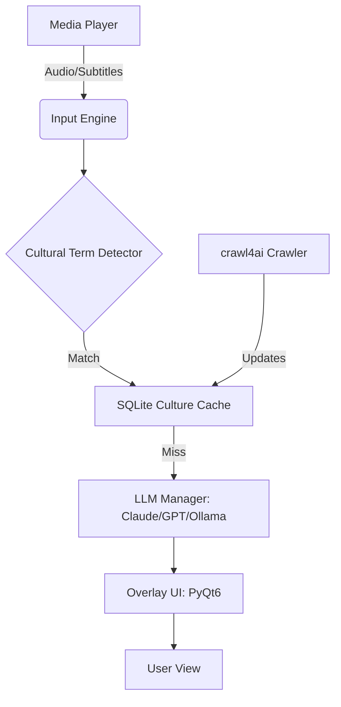

# 🏮 Culture Immersion Avatar
[](https://opensource.org/licenses/MIT)
[](https://www.python.org/downloads/)
[](https://www.riverbankcomputing.com/products/pyqt/)

**Real-time cultural context companion for foreign media — no Googling required.**

Imagine watching a Japanese anime or a Korean drama and instantly understanding a complex pun, a historical allusion, or a piece of internet slang without pausing the video or leaving the app. **Culture Immersion Avatar** is a transparent desktop overlay that acts as your personal "Regional Cultural Encyclopedia Expert," bridging the gap between literal translation and deep cultural resonance.

---

## ✨ Key Features

- 🏮 **Real-Time Cultural Notes**: Semi-transparent overlay that surfaces context-aware explanations for slang and idioms.
- 🎧 **Dual-Input Pipeline**: 
  - **Subtitle-First**: High-precision parsing of `.srt`, `.ass`, and `.vtt` files.
  - **Audio Fallback**: Real-time transcription using `Whisper-large-v3` when subtitles are absent.
- 🧠 **Context-Engineered AI**: A multi-tier LLM fallback chain (**Claude $\rightarrow$ GPT-4 $\rightarrow$ Ollama**) providing academic-grade cultural insights.
- 📚 **Series Memory**: Learns about characters and plot points over time to improve explanation relevance.
- ⚡ **Ultra-Low Latency**: Local SQLite culture cache to avoid redundant API calls for recurring terms.
- 🌐 **Self-Improving Knowledge**: Automated research crawler via `crawl4ai` to keep the cultural dictionary current.
- 🔊 **TTS Support**: Optional audio-whisper mode via Microsoft Edge TTS for eyes-free immersion.

---

## 🏗️ Architecture



---

## 🚀 Getting Started

### Prerequisites
- Python 3.10+
- FFmpeg (for audio processing)
- An API Key for Anthropic or OpenAI (or a local Ollama instance)

### Installation
1. **Clone the repository**
   ```bash
   git clone https://github.com/dungnotnull/culture-immersion-avatar-agent.git
   cd culture-immersion-avatar-agent
   ```

2. **Install dependencies**
   ```bash
   pip install -r requirements.txt
   ```

3. **Configure Environment**
   ```bash
   cp .env.example .env
   # Edit .env and add your API keys
   ```

4. **Run the application**
   ```bash
   python main.py
   ```

---

## 🛠️ Tech Stack

| Layer | Technology |
| :--- | :--- |
| **UI** | `PyQt6` (Transparent Always-on-Top Windows) |
| **Audio STT** | `OpenAI Whisper-large-v3` via HuggingFace |
| **NLP/NER** | `BERT-base-NER` & `Sentence-Transformers` |
| **LLM** | `Claude 3.5 Sonnet`, `GPT-4o`, `Ollama (Mistral/Llama3)` |
| **Data** | `SQLite3` (Local Cache), `JSON` (Series Memory) |
| **Automation** | `crawl4ai` (Knowledge Base Updates) |
| **TTS** | `edge-tts` |

---

## 🗺️ Roadmap
- [x] **Phase 0**: Research & Environment Setup
- [x] **Phase 1**: MVP Core Loop (Subtitles $\rightarrow$ LLM $\rightarrow$ Overlay)
- [x] **Phase 2**: ML Integration (Whisper STT, BERT NER)
- [x] **Phase 3**: LLM Deepening (Series Memory, TTS)
- [x] **Phase 4**: Self-Improving Knowledge Loop (Automated Crawling)
- [x] **Phase 5**: Testing, Polish & Distribution

---

## 📄 License
Distributed under the MIT License. See `LICENSE` for more details.

---

**Developed with ❤️ for the global community of language learners and cinephiles.**
